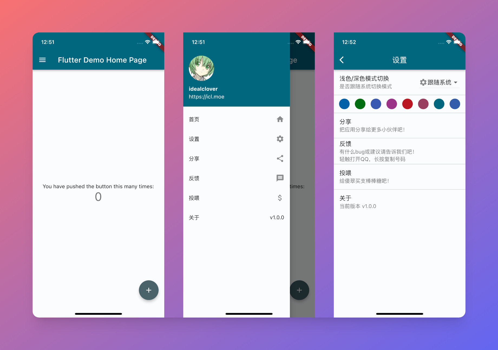
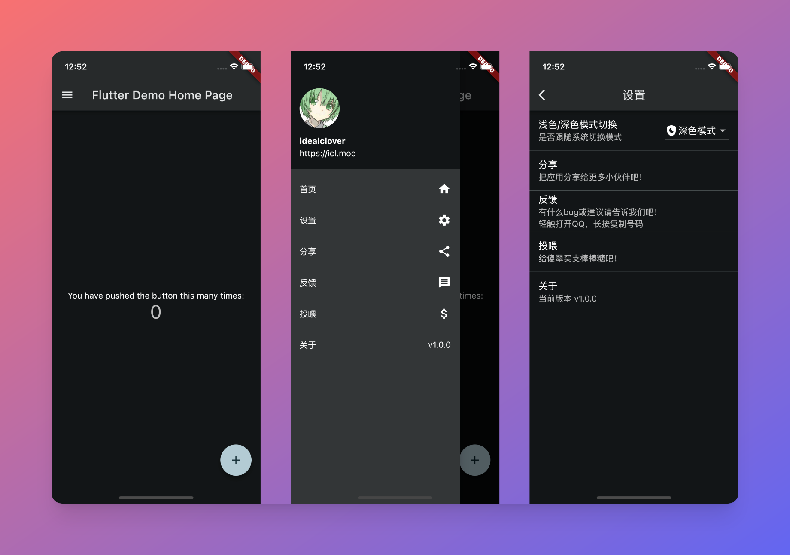
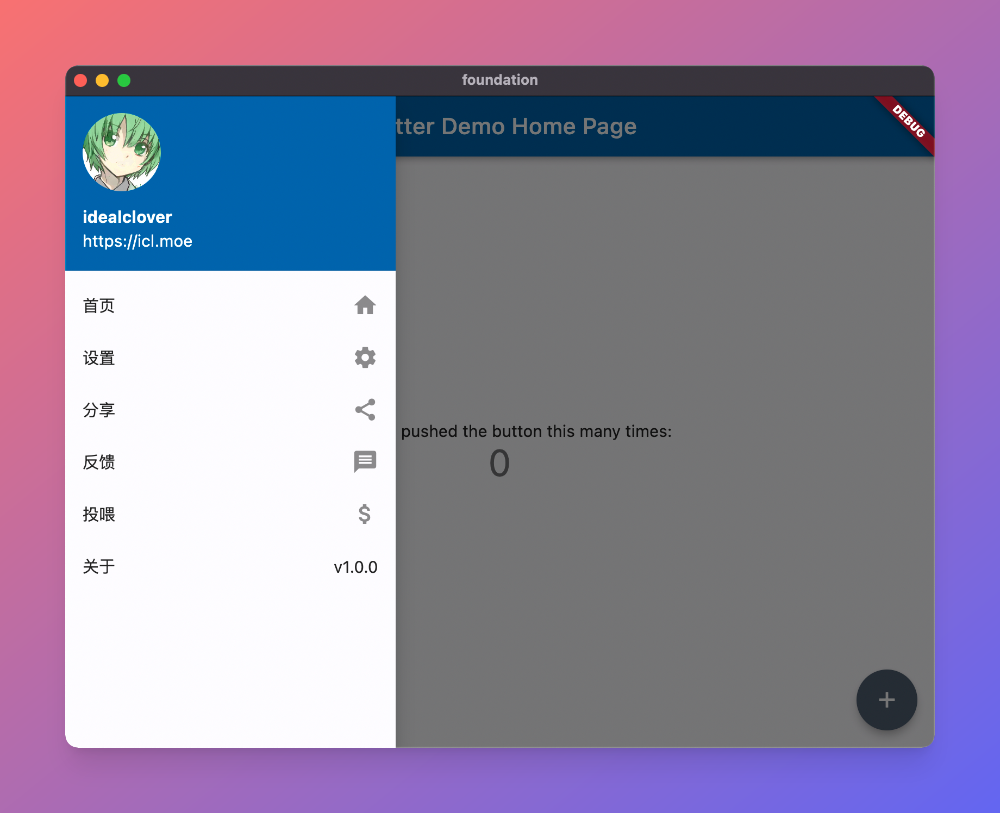

<h1 align="center">Flutter Foundation</h1>

> 🧰 My flutter-based app framework.

## 这是什么

实现了一些基础功能的 Flutter 应用脚手架。







## 为什么有这个项目

从用户视角看问题，对于一个 APP 来说，最重要的往往不是 APP 内的主要功能，而是「意见反馈」「更新」和「数据统计」功能

1.0 版本做的烂没关系，关键需要有方式能持续改进。

对于用户，就是要触达用户，告诉客户「我们在听」与「我们更新了」

否则，要么客户流失率会很高，要么，APP 已经出道 3.0 版本了，一大堆用户还不知道有更新，仍然停留在 0.1 版本 😳

对于自己，就是要有数据埋点，从客观上看客户在「怎么用」我们的软件

就需要移动统计的助力，有数据才相当于有地图，仗才能大的漂亮

另外，面向国内的应用一个绕不过去的问题就是「合规」，需要在 APP 启动时就对相关隐私政策与协议进行展示，可能在小 APP 时不用考虑那么多，但总要迈出做大的一步的。

还有就是一些基础的国际化功能。

而因为自己总会折腾些小项目，往往这些功能都需要重复使用。于是建造了一个基础的 APP 脚手架，覆盖了通用 APP 最重要的更新/分享/隐私合规/主题切换/移动统计等能力，以后写小 APP 再也不用重复造这些基础功能的轮子～

由于是基础的脚手架，也就尝试去追求最通用的能力，因此覆盖了 Flutter 支持的全部六端（Android/iOS/Web/Win/Mac/Linux）已支持 Flutter 3.0

## 为什么是 flutter？

首先可能我 flutter 项目起的比较多

其次，虽然大项目上 flutter 可能会遇到很多的坑，单对于小项目 flutter 确实是很独一无二的支持方案

* 坑相比其他跨平台解决方案（RN、uniapp 等）相对少
* 能使用的平台原生能力相对多
* 初期不需要重复开发安卓/iOS 甚至桌面端
* 一个 Widget 包所有的模式相对易懂灵活

对我来说 flutter 可能是冷启动一个小玩意很快速的方式，而我自己的小玩意，说到底就是请求请求网络、展示展示数据，花里胡哨的东西都用不到，所以也就相对舒适

不如以这个项目为始，你也来试一试～🎉

## 主要 feature

- [x] 主题切换
- [x] 主题自定义
- [x] 深色模式
- [x] 隐私合规
- [x] 分享应用
- [x] 默认国际化
- [x] 反馈功能
- [x] 关于页面
- [x] 更新模块
- [x] 捐助模块
- [x] 移动统计

## 谁在用

全部或部分使用该脚手架的项目：

* [南哪课表 APP](https://nju.app)
* 小刻食堂 APP（部分采用，升级中）
* Caritas APP（重构中）
* ...

如果这个项目对你的 APP 也有帮助，欢迎在 [issue](/issues) 中告诉我！

以及由于对 Flutter 架构了解不深，如果有问题与改进 欢迎各种 [issue](/issues) 和 [pull request](/pulls) ～

## 如何使用

### 基础：Flutter

This project is a starting point for a Flutter application.

A few resources to get you started if this is your first Flutter project:

- [Lab: Write your first Flutter app](https://docs.flutter.dev/get-started/codelab)
- [Cookbook: Useful Flutter samples](https://docs.flutter.dev/cookbook)

For help getting started with Flutter development, view the
[online documentation](https://docs.flutter.dev/), which offers tutorials,
samples, guidance on mobile development, and a full API reference.

### 基础之上的配置

1. 部署 ```api/``` 下的各文件到静态服务器上（用来进行更新、隐私信息查询）
2. 复制 ```lib/Resources/Config.sample.dart``` 为 ```lib/Resources/Config.dart``` 并填写基础信息
3. 更改包名（bundleId）和应用名称（appname），推荐使用 [rename](https://pub.dev/packages/rename) 这个插件

### LICENSE

[MIT LICENSE](./LICENSE). Have fun coding!

Long live open source.